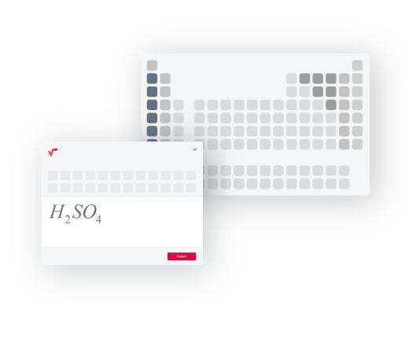
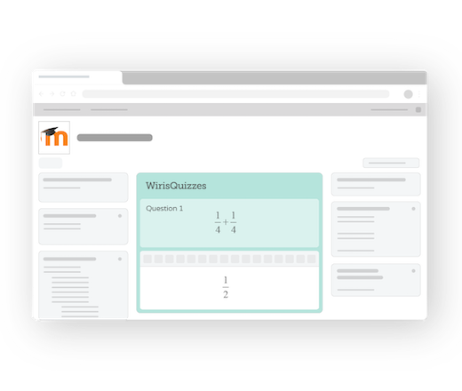

&nbsp;&nbsp;&nbsp; 

# wmd: a local development environment tool for the Wiris Moodle plugins suite

**wiris-moodle-docker**, `wmd` for short, is the perfect tool to try the whole set of Wiris math & science plugins. It helps you install on your computer a Moodle instance with the WIRIS plugins suite installed and some dummy content.

_This project has been created by the Wiris Engineering Team and is aimed at Moodle plugins developers and Moodle users interested to try the WIRIS Moodle Math & Science set._

**Index of contents**

- [Purpose](#purpose)
- [Features](#features)
- [User's guide](#users-guide)
    - [Before you begin](#before-you-begin)
    - [Quick start](#quick-start)
    - [How it works](#how-it-works)
    - [Scripts in action](#scripts-in-action)
- [FAQ](#faq)
- [Wiris Moodle math & science set](#wiris-moodle-math--science-plugins-set)
- [Technical Support or Questions](#technical-support-or-questions)
- [Privacy policy](#privacy-policy)
- [License](#license)

## Purpose

**wmd** is a collection of scripts aimed at Moodle Plugin developers to setup automatically a testing environment for Moodle that includes the Wiris math & science plugin set.

This tool depends heavily on [moodle-docker: Docker Containers for Moodle Developers](https://github.com/moodlehq/moodle-docker/), that does all the heavy-lifting to manage the Docker images.

## Features

* Zero-configuration approach.
* Zero-maintenance.
* Supports all [Moodle versions](https://github.com/moodle/moodle/branches/all).
* Supports all PHP versions.
* Supports all [MathType and Quizzes Moodle plugins](https://moodle.org/plugins/browse.php?list=set&id=66) versions.
* Behat/Selenium configuration for Firefox and Chrome.
* Catch-all smtp server and web interface to messages using MailHog.
* All PHP Extensions enabled configured for external services (e.g. solr, ldap)
* Downloads code from github with both `ssh` or `https`.
* Uses the branch name as source to download Moodle and WIRIS plugins.
* Support both Linux and MacOS; (Windows, coming soon).

## User's guide

Follow these instructions to set up your computer. 

### Before you begin

Install these on your computer:

* Git
* [Docker](https://docs.docker.com) and [Docker Compose](https://docs.docker.com/compose/) installed

> **Tip**: Check the excellent [tutorial on how to install Docker on Ubuntu](https://www.digitalocean.com/community/tutorials/how-to-install-and-use-docker-on-ubuntu-20-04) from the folks at Digital Ocean.

### Quick start

Firs step, will be to set up a path on your computer where the Moodle code will be downloaded to.

**A. Default settings**

We recommend you to add these values to your `.bashrc` file, so you don't need to set them again every time you use the tool.

```bash
# Recommended default values for 'wiris-moodle-docker'.
# Add this to your .bashrc file.
# More information at https://github.com/moodlehq/moodle-docker.

# 01. Set up path to all Moodles releases code, like '/var/www'.
# Required. 
export WEB_DOCUMENTROOT=/path/to/source/code

# 02. Set the Moodle branch to downlowad code from on the next install.
# Defaults to Moodle_311 (latest) if not set as environment variable.
# Recommended.
export WIRIS_MOODLE_BRANCH="MOODLE_310_STABLE"
# Recommended.
export MOODLE_DOCKER_WWWROOT=${WEB_DOCUMENTROOT}/${WIRIS_MOODLE_BRANCH}

# 03. Set whether you want to download the code from github using ssh (authenticated) or https. 
# Defaults to 'off' (https). Set to 'on' for 'ssh'.
# Note: you will need to set up your default ssh credentials on your profile at GitHub.
# For developers.
export WIRIS_MOODLE_MATHTYPE_DEV_MODE="on" 

# 04. Selenium will expose a VNC session on this port.
# Recommended.
export MOODLE_DOCKER_SELENIUM_VNC_PORT=5900
```

**B. Advanced settings**

There are some configuration settings that you may need to set from the Terminal, for the current session. 

```bash
# 01. Set the MathType plugins branch to downlowad code from on the next install.
# Defaults to 'stable' if not set as environment variable.
# Optional, not needed.
export WIRIS_MOODLE_MATHTYPE_BRANCH="stable" 

# 02. Set the Quizzes plugins branch to downlowad code from on the next install.
# Defaults to 'main' if not set as environment variable.
# Optional, not needed.
export WIRIS_MOODLE_QUIZZES_BRANCH="main"

# 03. Set the PHP version to install on the next build. 
# Defaults to PHP7_4 if not set as environment variable.
export MOODLE_DOCKER_PHP_VERSION="7.4"
```

> **Note**: For more information about all these configuration settings, and a few more available, visit the [moodle-docker](https://github.com/moodlehq/moodle-docker/) documentation.

### How it works

There are three groups of commands, depending on which step on the installation you are: 

- `install` => `start` => `test`.

> **Note**: You'll need to execute them sequentially in order to work. Example: you can't `start` the Moodle instance if you don't run the `install` command, first.

**Command list**

| Command   | Description                                             | Subcommands       |
| --------- | ------------------------------------------------------- | ----------------- |
| `install` | Downloads the Moodle code to your computer              | `clean`, `delete` |
| `start`   | Starts a ready-to-use Moodle instance on your computer  | `restart`, `stop` |
| `test`    | Runs all available automated tests on behat and phpunit | `test-init`       |

**01. Install**

Install downloads all the necessary files and dependencies to your local computer using `git`; including the last version of [moodle-docker](https://github.com/moodlehq/moodle-docker/) project.

```bash
# Set a Moodle version of your choice for this session.
export WIRIS_MOODLE_BRANCH="MOODLE_39_STABLE"

# Let's download everything from git.
$ ./bin/wiris-moodle-docker-install

# Subcommands: clean, delete.
# Deletes all WIRIS plugins both MathType and Quizzes; eventually, you could change the WIRIS_MOODLE_*_BRANCH values.
$ ./bin/wiris-moodle-docker-clean

# Removes the whole Moodle branch directory on the $WEB_DOCUMENTROOT folder.
$ ./bin/wiris-moodle-docker-delete
```

**02. Start**

It configures and starts the docker containers that will serve the Moodle instances as defined on the install step.

```bash
# Set a PHP version of your choice for this session.
export MOODLE_DOCKER_PHP_VERSION="7.2"

# Let's start the Moodle instance.
$ ./bin/wiris-moodle-docker-start

# Open http://localhost:8000 to access the Moodle instance.

# Subcommands: restart, stop.
# Restart containers.
$ ./bin/wiris-moodle-docker-restart
# Shut down containers.
$ ./bin/wiris-moodle-docker-stop
```

> **Notes:**
> - The Moodle intance is configured to listen on http://localhost:8000/.
> - Mailhog is listening on http://localhost:8000/_/mail to view emails which Moodle has sent out.
> - The admin username you need to use for logging in is admin by default. [Check the FAQ](#faq) section.

**03. Test**

Initializes behat and/or phpunits test environments and allows you to run all available tests for the WIRIS suite of Moodle plugins.

```bash
$ ./bin/wiris-moodle-docker-test

# Subcommands: init.
# Initializa the tests environments for both behat and phpunit testing: behat and phpunit.
$ ./bin/wiris-moodle-docker-test-init

# Then, you'll be able to run phpunit and behat tests of any plugin:
# Example: Run some behat tests by @tag.
./moodle-docker/bin/moodle-docker-compose exec -u www-data webserver php admin/tool/behat/cli/run.php -vvv --colors --tags=@filter_wiris

# Example: Run a phpunit tests
./moodle-docker/bin/moodle-docker-compose exec webserver vendor/bin/phpunit auth_manual_testcase auth/manual/tests/manual_test.php

```

**Using VNC to view running tests**

If `MOODLE_DOCKER_SELENIUM_VNC_PORT` is defined, selenium will expose a VNC session on the port specified so behat tests can be viewed in progress.

For example, if you set `MOODLE_DOCKER_SELENIUM_VNC_PORT` to 5900.

1. Download a VNC client: https://www.realvnc.com/en/connect/download/viewer/
2. With the containers running, enter 0.0.0.0:5900 as the port in VNC Viewer. You will be prompted for a password. The password is `'secret'`.
3. You should be able to see an empty Desktop. When you run any Behat tests a browser will popup and you will see the tests execute.


> **Notes:**
> 
> - The behat faildump directory is exposed at http://localhost:8000/_/faildumps/.
> - If you want to run phpunit tests with coverage report, use command: `./moodle-docker/bin/moodle-docker-compose exec webserver phpdbg -qrr vendor/bin/phpunit --coverage-text auth_manual_testcase auth/manual/tests/manual_test.php`
> - If `MOODLE_DOCKER_SELENIUM_VNC_PORT` is defined, selenium will expose a VNC session on the port specified so behat tests can be viewed in progress; [more information](https://github.com/moodlehq/moodle-docker#using-vnc-to-view-behat-tests).


### Scripts in action

```bash
# Set a Moodle version of your choice for this session.
export WIRIS_MOODLE_BRANCH="MOODLE_35_STABLE"
# Set a PHP version of your choice for this session.
export MOODLE_DOCKER_PHP_VERSION="7.1"

# Install: 
# Downloads Moodle, Moodle-docker and WIRIS plugins source code to $WEB_DOCUMENTROOT.
./bin/wiris-moodle-docker-install

# Starts the Moodle instance's containers, loads a dummy content db and serve it on http://localhost:8000.
./bin/wiris-moodle-docker-start

# Work with the Moodle instance's containers (see below)
# [..]

# Shut down containers.
./bin/wiris-moodle-docker-stop

# Restart containers; eventually, you could change the MOODLE_DOCKER_PHP_VERSION value.
./bin/wiris-moodle-docker-restart

# Initialize all test environments
./bin/wiris-moodle-docker-test-init

# Examples: Run behat tests
./moodle-docker/bin/moodle-docker-compose exec -u www-data webserver php admin/tool/behat/cli/run.php --tags=@filter_wiris -vvv --colors
./moodle-docker/bin/moodle-docker-compose exec -u www-data webserver php admin/tool/behat/cli/run.php --tags=@wiris_mathtype -vvv -colors

# Example: Run phpunit tests
./moodle-docker/bin/moodle-docker-compose exec webserver vendor/bin/phpunit auth_manual_testcase auth/manual/tests/manual_test.php

# All-in-one: Initialize all environments and execute all available tests.
./bin/wiris-moodle-docker-test

# Install clean:
# Deletes all WIRIS plugins both MathType and Quizzes; eventually, you could change the WIRIS_MOODLE_*_BRANCH values.
./bin/wiris-moodle-docker-clean

# Install delete:
# Removes the whole Moodle branch directory on the $WEB_DOCUMENTROOT folder.
./bin/wiris-moodle-docker-delete

```

## FAQ

### What `wmd` stands for?

[Wiris](https://www.wiris.com) + [Moodle](https://moodle.org/) + [Docker](https://www.docker.com/).

### Which versions of Moodle can I install?

Check the Moodle's project at GitHub for [a full list of Moodle versions available](https://github.com/moodle/moodle/branches/all) using the Git branch name to set the environment variable, like `export WIRIS_MOODLE_BRANCH="MOODLE_311_STABLE"`. 

### Can I run two different Moodle instances simultaneously with this tool?

No.

One Moodle Instance only can be run at the same time with this method.

You will need to update the value of the `WIRIS_MOODLE_BRANCH` variable and run `stop` + `install` + `start` commands, every time in order to switch between Moodle instances.

### What is the complete list of WIRIS MathType Moodle plugins?

- [MathType Filter](https://github.com/wiris/moodle-filter_wiris/)
- [MathType for Atto Editor](https://github.com/wiris/moodle-atto_wiris/)
- [MathType for TinyMCE Editor](https://github.com/wiris/moodle-tinymce_tiny_mce_wiris)

### What is the complete list of WIRIS Quizzes Moodle plugins?

- [moodle-qtype_essaywiris](https://github.com/wiris/moodle-qtype_essaywiris)
- [moodle-qtype_shortanswerwiris](https://github.com/wiris/moodle-qtype_shortanswerwiris) 
- [moodle-qtype_wq](https://github.com/wiris/moodle-qtype_wq)
- [moodle-local_wirisquizzes](https://github.com/wiris/moodle-local_wirisquizzes)
- [moodle-qtype_matchwiris](https://github.com/wiris/moodle-qtype_matchwiris)
- [moodle-qtype_multianswerwiris](https://github.com/wiris/moodle-qtype_multianswerwiris)
- [moodle-qtype_multichoicewiris](https://github.com/wiris/moodle-qtype_multichoicewiris)
- [moodle-qtype_truefalsewiris](https://github.com/wiris/moodle-qtype_truefalsewiris)

### How can I login to Moodle?

There are these three users for you to try the Moodle instance:

| Role              | User    | Password   |
| ----------------- | ------- | ---------- |
| **Administrator** | admin   | admin@A1   |
| **Teacher**       | teacher | teacher@A1 |
| **Student**       | student | student@A1 |

### What behat tests tags are available for the MathType suite of Moodle plugins ?

This is the current list of available tags to help you filter which test files to execute using the `run.php` behat script, manually.

- `@filter`
- `@filter_wiris`
- `@filter_wiris_render`
- `@filter_wiris_render_server`
- `@filter_wiris_render_image`
- `@filter_wiris_settings`
- `@editor`
- `@editor_atto`
- `@atto`
- `@atto_wiris`
- `@tinymce`
- `@tinymce_tiny_mce_wiris`

### How can I run a behat test manually using the tags above?

```bash

# Make sure the test environment is initialized.
./bin/wiris-moodle-docker-test-init

# Examples: Run behat tests
./moodle-docker/bin/moodle-docker-compose exec -u www-data webserver php admin/tool/behat/cli/run.php --tags=@filter_wiris -vvv --colors

```

Check the [User's guide](#users-guide) above for more useful commands. 

### How to update/export the database of a new Moodle version?

You may have changes to the database that you would like to install by default everytime you use the `start` command.
Or maybe, there's a new Moodle version available and you'd like to generate a sql dump file for this new version. 

```bash
# (parameter) Set up the Moodle version to download using the branch name convention.
export WIRIS_MOODLE_BRANCH="MOODLE_38_STABLE" 

./bin/wiris-moodle-docker-install
./bin/wiris-moodle-docker-start

./moodle-docker/bin/moodle-docker-compose exec -T db mysqldump -u moodle -pm@0dl3ing moodle > databases/${WIRIS_MOODLE_BRANCH}.sql

```

### How can I import my own Moodle database dump?

```bash
# Import: you may want to load a database from another source...?
./moodle-docker/bin/moodle-docker-compose exec -T db mysql -u moodle -pm@0dl3ing moodle < [YOUR-DIRECTORY]/databases/${WIRIS_MOODLE_BRANCH}.sql

```

## Wiris Moodle math & science plugins set


_Type and handwrite mathematical notation in Moodle with MathType. The popular equation editor for MS Word is now seamlessly integrated into Moodle._


_A flavor of MathType designed to help you work with chemical notation. It includes common chemical symbols and a user experience adapted to chemistry authors._




_Wiris Quizzes takes Moodle Quizzes one step further: computer based grading of math and science questions, random parameters or graphics in your STEM quizzes._



## Technical Support or Questions

If you have questions about MathType, Quizzes or need help integrating MathType, please contact us (support@wiris.com) instead of opening an issue.

## Privacy policy

The [MathType Privacy Policy](http://www.wiris.com/mathtype/privacy-policy) covers the data processing operations for the MathType users. It is an addendum of the company’s general Privacy Policy and the [general Privacy Policy](https://wiris.com/en/privacy-policy) still applies to MathType users.

## License

MathType filter by [WIRIS](http://www.wiris.com) is licensed under the [GNU General Public, License Version 3](https://www.gnu.org/licenses/gpl-3.0.en.html).

